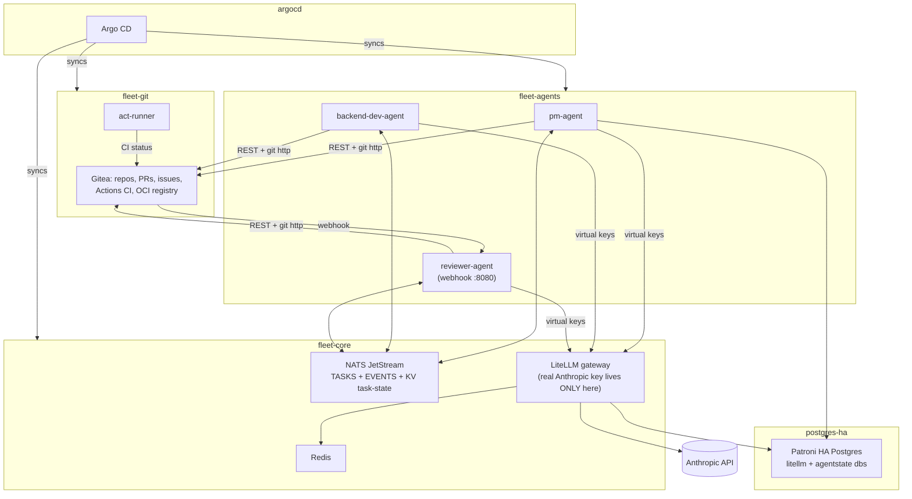
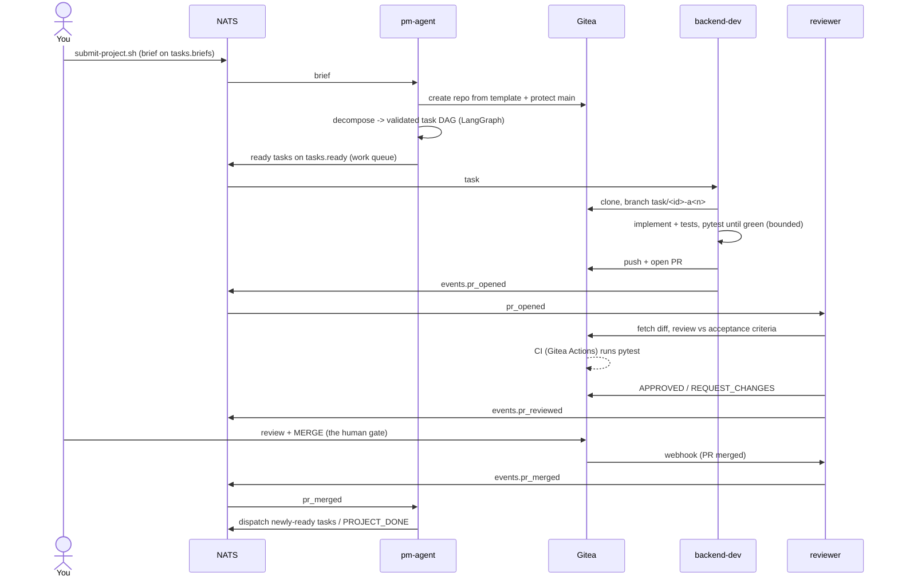

# Architecture

## Principles

1. **Git is the coordination layer, not chat.** Agents coordinate through branches,
   PRs, CI checks, and issues — the same primitives human teams use. Research on
   multi-agent software engineering consistently shows prompt-based coordination
   fails where branch-and-merge with test gates succeeds.
2. **Constrained roles.** The PM cannot code. The developer cannot review or merge.
   The reviewer cannot write code. Every constraint eliminates a failure class
   (the Drafter / Reviewer / Integrator pattern).
3. **Humans gate merges and deploys.** Agents propose; branch protection plus Argo CD
   ensure nothing lands or ships without a human. Escalation is a designed feature.
4. **Everything bounded.** Iteration limits per task, attempt limits per task,
   dollar budgets per agent per day, resource quotas per namespace.
5. **GitOps for the fleet itself.** The fleet is deployed exactly like
   `patroni-postgres-ha`: App-of-Apps -> AppProject + ApplicationSet -> `envs/local/*`.

## Deployment view

Sync waves: `00-security` (0) -> Gitea/NATS/Redis (1) -> LiteLLM (2) -> agents (3).

## Task lifecycle

Failure paths: a failed attempt publishes `events.task_failed`; the PM re-dispatches
until `FLEET_MAX_TASK_ATTEMPTS`, then opens an `[escalation]` issue with full context
(spec, criteria, last error, correlation_id) and stops. A reviewer rejection is
treated the same way, with the feedback appended to the re-dispatched task's spec.

## Messaging design

| Stream | Retention | Subjects | Consumers |
|--------|-----------|----------|-----------|
| TASKS  | WorkQueue (each message consumed once) | `tasks.briefs`, `tasks.ready` | PM (briefs), dev agents (ready) |
| EVENTS | Limits, 7d | `events.<type>` | PM and reviewer hold independent durable cursors |

Authoritative task state lives in the JetStream KV bucket `task-state`
(`task.<project>.<task_id>`), so every agent is stateless and restartable. The
correlation_id assigned at brief submission is stamped on every task, event, log
line, PR body, and escalation issue (`fleet_common/tracing.py`).

## LLM access

One real Anthropic key, held only by LiteLLM (`helm-values/litellm.yaml`). Each agent
gets a virtual key with a model allowlist, RPM limit, and a hard daily budget
(`scripts/bootstrap.sh`). Models are aliased (`claude-sonnet`, `claude-haiku`) so a
model swap is a values edit, not a code change. Keys, teams, and spend live in the
`litellm` database on the existing Patroni cluster; LangGraph checkpoints live in
`agentstate` on the same cluster.

## Deliberate homelab tradeoffs

| Decision | Tradeoff | Revisit when |
|----------|----------|--------------|
| Gitea on SQLite, 1 replica | No HA for git | The fleet outgrows Phase 2 / moves to EKS |
| Single NATS server (file-backed) | Restart pauses the fleet; no data loss | Same |
| No gVisor/kagent sandbox yet | Agent code runs in a restricted-PSS pod, mitigated by NetworkPolicy + non-root + quotas | Phase 2 |
| Flannel does not enforce NetworkPolicy | Policies are declared but inert until Calico/Cilium is installed | Do this early — see RUNBOOK |
| Reviewer bot approval is advisory | Gitea counts bot approvals toward required_approvals; the human gate relies on you merging, and on bots not having merge rights | Tighten team permissions in Phase 2 |
