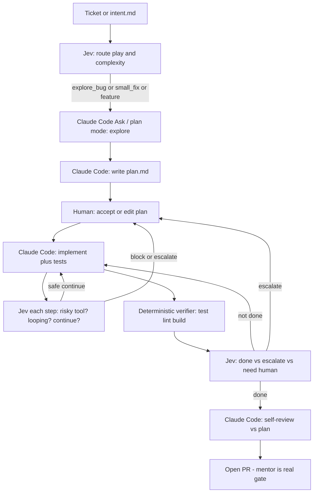

# Implementation: Claude Code + Jev (TypeSafe AI)

**Status:** chosen stack for the internship-success personal loop  
**Intent:** [intent/internship-success-loop.md](../intent/internship-success-loop.md)  
**Design:** [AI_NATIVE_SDLC.md](AI_NATIVE_SDLC.md)

## Decision

| Layer | Tool | Job |
|-------|------|-----|
| **Generate / act** | [Claude Code](https://code.claude.com/docs/en/best-practices) (Anthropic) | Explore, plan, edit, run tests, draft PRs — open-ended coding |
| **Decide / gate** | [Jev](https://typesafe.ai/blog/introducing-system-one-models-and-jev) (TypeSafe AI System One) | Fast typed decisions: Choice / Score / Noul — route, risk, loop-detect, “done?”, escalate |

Jev does **not** write code. Claude Code does **not** replace cheap structured gates.  
Together: generative agent + learned semantic branch instructions (harness pattern).

Sources: [Building a harness with Jev](https://www.langchain.com/blog/building-a-harness-with-jev), TypeSafe agent patterns, Claude Code best practices.

---

## Responsibility split

| Step | Owner | Notes |
|------|--------|------|
| Write / refine ticket `intent.md` | You (+ Claude Code draft) | Template from intent folder |
| Pick play (`bug` / `explore` / `feature` / `script_to_app`) | **Jev Choice** | Confidence gate → ask human if low |
| Complexity → model effort | **Jev Score or Choice** | Cheap path vs full Sonnet session |
| Ambiguity high? | **Jev Noul** | If true → stop and list open questions before coding |
| Explore + `plan.md` | **Claude Code** (plan / ask mode first) | No edits until plan accepted for non-trivial work |
| Implement + tests | **Claude Code** (code mode) | Small blast radius |
| Pre-tool safety (e.g. destructive shell) | **Jev Noul / Choice** | Block or require confirm — AutoMode pattern |
| Same failure again? | **Jev Noul** on recent trace | Cap retries; escalate with evidence |
| Tests / lint green? | **Deterministic commands** | Never Jev/LLM as sole “done” |
| Plan-compliant & ready for mentor? | **Jev Noul** + Claude self-review | Mentor still merges / approves |
| Overnight multi-role fleet | Out of daily path | Lab only ([FLEET_RETROSPECTIVE.md](FLEET_RETROSPECTIVE.md)) |

---

## Jev question catalog (v1)

Keep questions short, criteria explicit, thresholds measured — not guessed.

### Intake (once per ticket)

1. **play** — `Choice`: `explore` | `bugfix` | `small_feature` | `script_to_app` | `test_pipeline` | `docs`  
2. **complexity** — `Score` (e.g. 1–5): local change → cross-cutting  
3. **ambiguity** — `Noul`: “Intent is missing info that should block implementation”  
4. **needs_plan_gate** — `Noul`: “Blast radius warrants human plan approval before edits”

### Hot path (each agent step or tool batch)

5. **tool_risk** — `Noul` / `Choice`: safe auto vs confirm vs deny (paths, secrets, force-push, prod)  
6. **is_looping** — `Noul`: “Same failing approach repeating without new evidence”  
7. **should_compact_or_new_session** — `Noul`: context fat / goal drift  

### Exit

8. **verifier_passed** — filled by **code** from exit codes (not Jev)  
9. **ready_for_pr** — `Noul`: plan criteria met + residual risks documented  
10. **escalate_to_human** — `Noul`: out of budget, blocked, or confidence low on critical gate  

Batch multiple questions per Jev call (parallel eval, same state).

---

## Claude Code operating mode

Encode in project `CLAUDE.md` / skills (personal practice repos first; employer repos only under their policy):

1. Explore before edit on unfamiliar code  
2. Write `plan.md` for non-trivial work; wait if `needs_plan_gate`  
3. Co-generate tests; run the real verifier  
4. Prefer small PRs; document residual risks  
5. Install TypeSafe skill when scaffolding Jev calls:  
   `npx skills add typesafe-ai/skills --skill typesafe-ai`  
   or Claude plugin `typesafe@typesafe-ai` (see TypeSafe docs)

Claude Code = the **ACI** (files, shell, git). Jev = the **control plane** judgments.

---

## What we build in this repo (phased)

### Phase I — Spec + templates (now → days)

- This document + ticket templates (`intent`, `plan`, PR checklist)
- Documented Jev question catalog and default confidence policy (start conservative)
- `CLAUDE.md` skeleton for the personal practice workflow

### Phase II — Thin decision helper (local CLI / scripts)

- Small Python or TS helper: `jev_decide(state, questions) → branch`
- Env: `TYPESAFE_API_KEY`; model `jev-latest` (pin when stable)
- Commands: `loop intake`, `loop step-check`, `loop exit-check`
- Log receipts: play, complexity, noul values, confidence, stop reason
- Fallback: if TypeSafe unavailable, fail **closed** on safety gates; allow manual override for routing only

### Phase III — Wire into daily Claude Code use

- Skills / hooks that call the helper before risky tools and at session exit
- Optional LangChain `TypeSafeClassifier` / middleware if we add a custom runner later
- Do **not** require NATS / pm-agent / reviewer pods for the internship daily path

### Phase IV — Optional later

- Managed Agents or custom Messages API runner that embeds the same Jev gates
- Fleet lab remains separate SKU for overnight greenfield experiments

---

## Config and secrets

| Secret / config | Where |
|-----------------|--------|
| Anthropic / Claude Code auth | Local Claude Code / Anthropic account — not committed |
| `TYPESAFE_API_KEY` | Local env / secret manager — not committed |
| LiteLLM (fleet lab only) | Existing cluster secrets |

Never put employer code, tickets with PII, or signed plans into this public repo’s examples.

---

## Success criteria for this implementation choice

- Routing and “should I stop?” decisions are mostly **Jev**, not extra Sonnet calls  
- Code changes and explanations are mostly **Claude Code**  
- Verifier remains deterministic  
- Mentor-facing PRs include short evidence (commands run, residual risks)  
- Cost per ticket drops vs three-agent fleet for interactive work  

## Non-goals

- Replacing Claude Code with Jev  
- Replacing tests with Jev “done” scores  
- Deploying the kubeadm agent-fleet into the employer environment as the default tool
